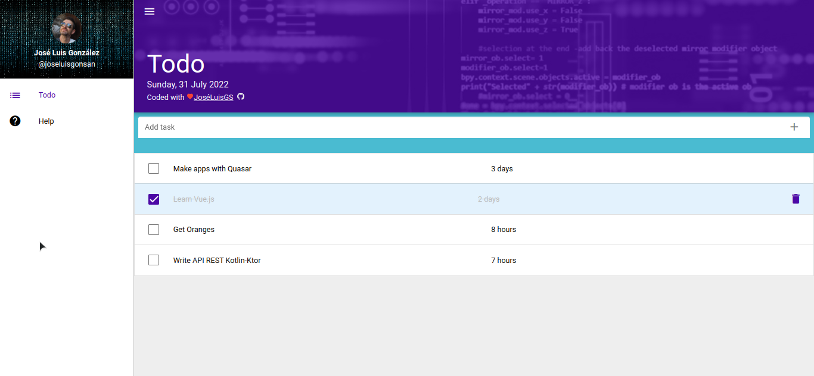
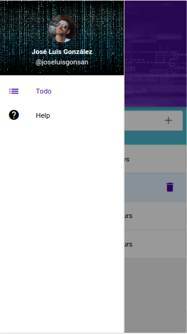
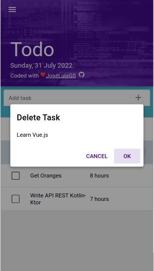

# Vue Quasar Todo

Una app multiplataforma hecha con Vue.js usando Quasar para manejar tareas.

[](https://es.vuejs.org/)
[](https://quasar.dev)
[](https://joseluisgs.github.io/docs/license/)


<p align="center">
  <a href="https://joseluisgs.github.io/" target="_blank"></a>
</p>

- [Vue Quasar Todo](#vue-quasar-todo)
  - [Acerca de](#acerca-de)
  - [Install the dependencies](#install-the-dependencies)
    - [Start the app in development mode (hot-code reloading, error reporting, etc.)](#start-the-app-in-development-mode-hot-code-reloading-error-reporting-etc)
    - [Lint the files](#lint-the-files)
    - [Format the files](#format-the-files)
    - [Build the app for production](#build-the-app-for-production)
    - [Customize the configuration](#customize-the-configuration)
  - [Autor](#autor)
    - [Contacto](#contacto)
    - [¿Un café?](#un-café)
  - [Licencia de uso](#licencia-de-uso)

## Acerca de
Sencilla apliación para mostrar la potencia de usar Vue.js con Quasar para hacer aplicaciones multiplataforma: web, escritorio, ssr, móviles, etc.

Se ha realizado un gestor de tareas multiplataforma.






## Install the dependencies
```bash
yarn
# or
npm install
```

### Start the app in development mode (hot-code reloading, error reporting, etc.)
```bash
quasar dev
```


### Lint the files
```bash
yarn lint
# or
npm run lint
```


### Format the files
```bash
yarn format
# or
npm run format
```


### Build the app for production
```bash
quasar build
```

### Customize the configuration
See [Configuring quasar.config.js](https://v2.quasar.dev/quasar-cli-vite/quasar-config-js).

## Autor

Codificado con :sparkling_heart: por [José Luis González Sánchez](https://twitter.com/joseluisgonsan)

[](https://twitter.com/joseluisgonsan)
[](https://github.com/joseluisgs)

### Contacto

<p>
  Cualquier cosa que necesites házmelo saber por si puedo ayudarte 💬.
</p>
<p>
 <a href="https://joseluisgs.github.io/" target="_blank">
        
    </a>  &nbsp;&nbsp;
    <a href="https://github.com/joseluisgs" target="_blank">
        
    </a> &nbsp;&nbsp;
        <a href="https://twitter.com/joseluisgonsan" target="_blank">
        
    </a> &nbsp;&nbsp;
    <a href="https://www.linkedin.com/in/joseluisgonsan" target="_blank">
        
    </a>  &nbsp;&nbsp;
    <a href="https://discordapp.com/users/joseluisgs#3560" target="_blank">
        
    </a> &nbsp;&nbsp;
    <a href="https://g.dev/joseluisgs" target="_blank">
        
    </a>    
</p>

### ¿Un café?

<p><a href="https://www.buymeacoffee.com/joseluisgs"> </a></p><br><br><br>

## Licencia de uso

Este repositorio y todo su contenido está licenciado bajo licencia **Creative Commons**, si desea saber más, vea la [LICENSE](https://joseluisgs.github.io/docs/license/). Por favor si compartes, usas o modificas este proyecto cita a su autor, y usa las mismas condiciones para su uso docente, formativo o educativo y no comercial.

<a rel="license" href="http://creativecommons.org/licenses/by-nc-sa/4.0/"></a><br /><span xmlns:dct="http://purl.org/dc/terms/" property="dct:title">JoseLuisGS</span> by <a xmlns:cc="http://creativecommons.org/ns#" href="https://joseluisgs.github.io/" property="cc:attributionName" rel="cc:attributionURL">José Luis González Sánchez</a> is licensed under a <a rel="license" href="http://creativecommons.org/licenses/by-nc-sa/4.0/">Creative Commons Reconocimiento-NoComercial-CompartirIgual 4.0 Internacional License</a>.<br />Creado a partir de la obra en <a xmlns:dct="http://purl.org/dc/terms/" href="https://github.com/joseluisgs" rel="dct:source">https://github.com/joseluisgs</a>.
